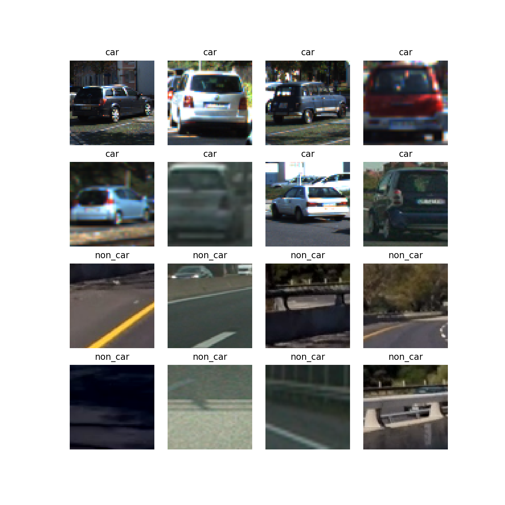
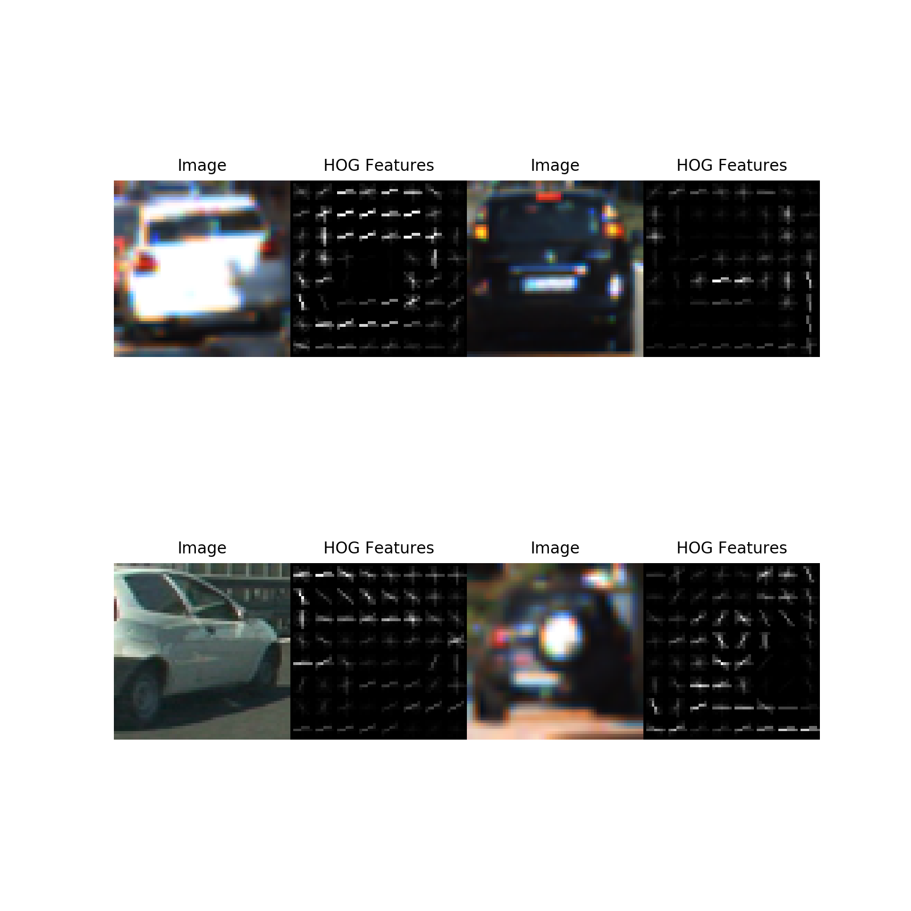
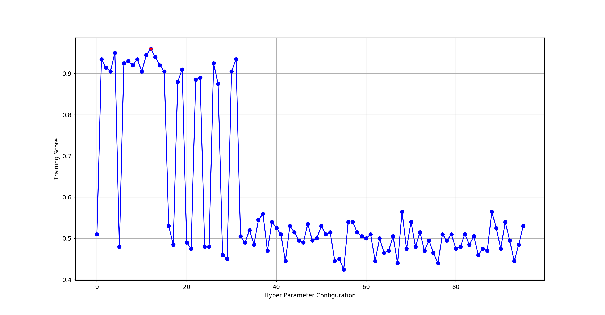
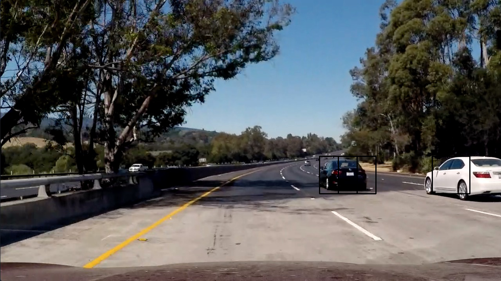
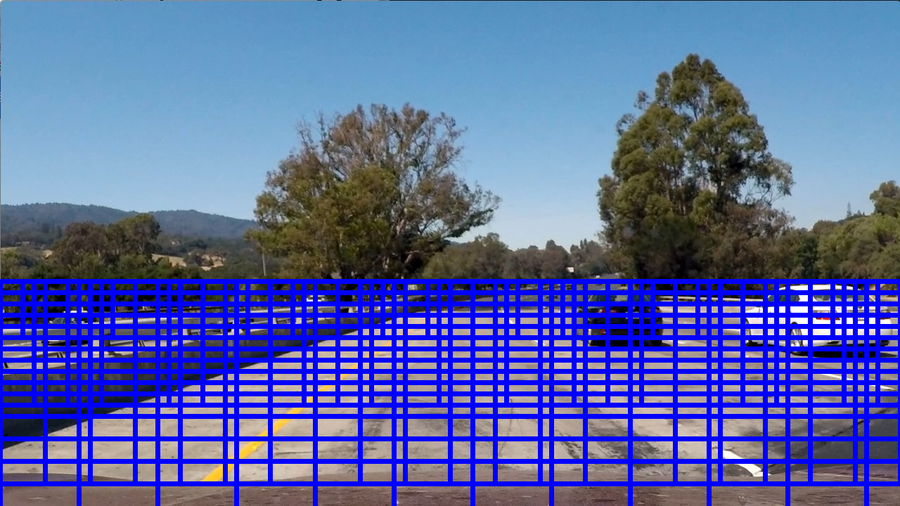
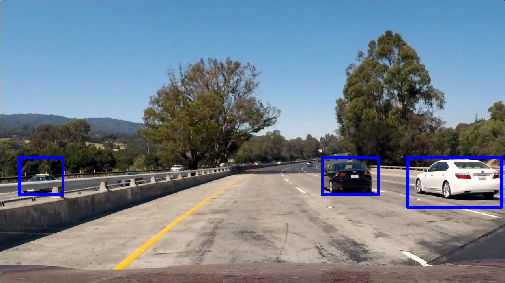
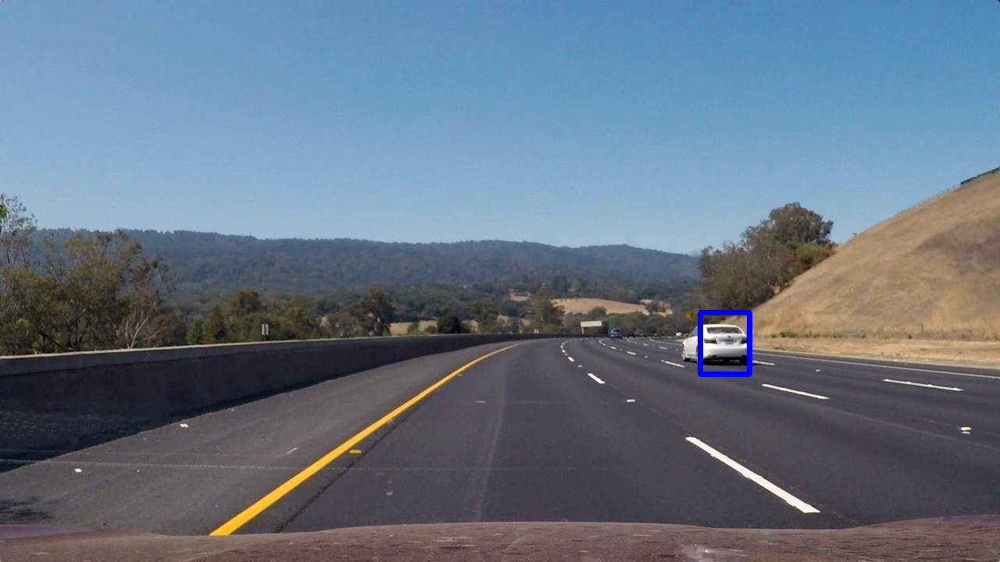
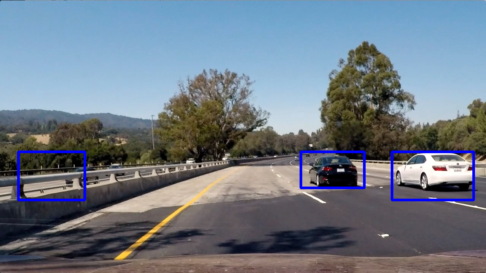
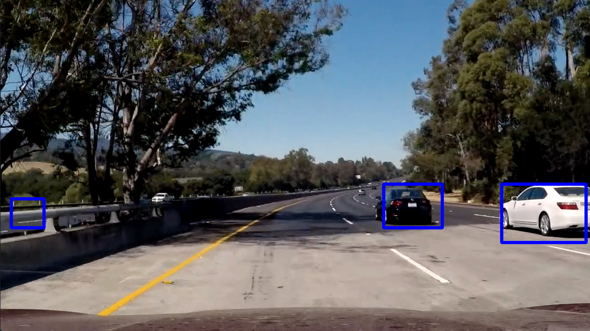
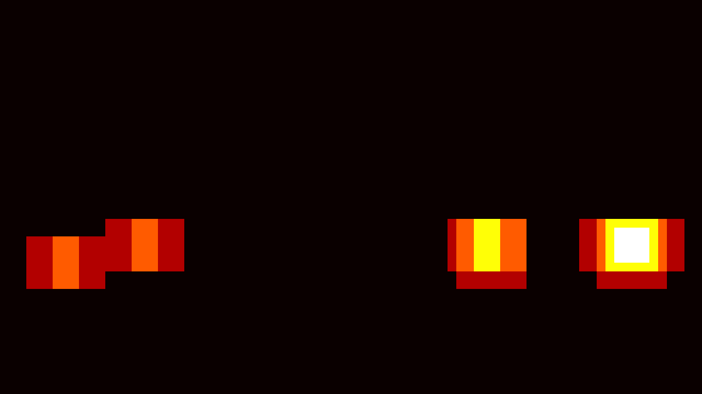

## Vehicle Detection Project

**The goals / steps of this project are the following:**

* Perform a Histogram of Oriented Gradients (HOG) feature extraction on a labeled training set of images and train a classifier Linear SVM classifier
* Optionally, you can also apply a color transform and append binned color features, as well as histograms of color, to your HOG feature vector. 
* Note: for those first two steps don't forget to normalize your features and randomize a selection for training and testing.
* Implement a sliding-window technique and use your trained classifier to search for vehicles in images.
* Run your pipeline on a video stream (start with the test_video.mp4 and later implement on full project_video.mp4) and create a heat map of recurring detections frame by frame to reject outliers and follow detected vehicles.
* Estimate a bounding box for vehicles detected.

## [Rubric Point](https://review.udacity.com/#!/rubrics/513/view)
### Here I will consider the rubric points individually and describe how I addressed each point in my implementation.  

---
### Writeup / README

#### 1. Provide a Writeup / README that includes all the rubric points and how you addressed each one.  You can submit your writeup as markdown or pdf.  [Here](https://github.com/udacity/CarND-Vehicle-Detection/blob/master/writeup_template.md) is a template writeup for this project you can use as a guide and a starting point.  

You're reading it!

### Histogram of Oriented Gradients (HOG)

#### 1. Explain how (and identify where in your code) you extracted HOG features from the training images.

Hog feature extraction is implemented in `[vehicle_detection.py](./vehicle_detection.py)`, the `Features` class was used to extract features for training and prediction purposes.

I started by reading in all the `vehicle` and `non-vehicle` images datasets.  Here is an example of one of each of the `vehicle` and `non-vehicle` classes:



I then explored different color spaces and different  parameters: 

```python
    colorspaces = ["RGB", "HSV", "LUV"]
    orients = [12]
    pix_per_cells = [8, 16]
    cell_per_blocks = [2]
    hog_channels = [0,1,2,"ALL"]
    spatial_feats = [True]
    hist_feats = [True]
    spatial_sizes = [(16,16), (32,32)]
    hist_bins = [16, 32]
```

The `extract_features` method (line 311-356), is extracted from the lesson examples, it uses the [`skimage.hog()`](http://scikit-image.org/docs/dev/auto_examples/features_detection/plot_hog.html) for any the defined channels and colorspaces.

An example of HOG features for the following parameters is shown below, I will discuss later on why I started with those parameters.
```python
    colorspaces = "RGB"
    orients = 12
    pix_per_cells = 8
    cell_per_blocks = 2
    hog_channels = ALL
    spatial_feats = [True]
    hist_feats = [True]
    spatial_sizes = (16,16)
    hist_bins = (32)
```



#### 2. Explain how you settled on your final choice of HOG parameters and features vector.

There is a significant number of hyperparameters to tune. The interactions between them cannot be easily understood and appear to be highly non-linear.

* `Training_Mode`: I complied list of the all the required hyper parameters for the feature vector:

```python
    colorspaces = ["RGB", "HSV", "LUV"]
    orients = [12]
    pix_per_cells = [8, 16]
    cell_per_blocks = [2]
    hog_channels = [0,1,2,"ALL"]
    spatial_feats = [True]
    hist_feats = [True]
    spatial_sizes = [(16,16), (32,32)]
    hist_bins = [16, 32]

    hyper_parameters = itertools.product(colorspaces, 
                                        orients,
                                        pix_per_cells,
                                        cell_per_blocks,
                                        hog_channels,
                                        spatial_feats,
                                        hist_feats,
                                        spatial_sizes,
                                        hist_bins)
```

* Loaded only 500 vehicle & 500 non-vehicle images
> 80% training, 20% test
> Randomly shuffled

The results from the training are stores in [training_scores.csv](./training_scores.csv),

The training time and accuracy for the hyper parameter sets created above are shown here:




I started by selecting the best set of hyperparameters from this analysis:
```python
    colorspaces = "RGB"
    orients = 12
    pix_per_cells = 8
    cell_per_blocks = 2
    hog_channels = ALL
    spatial_feats = [True]
    hist_feats = [True]
    spatial_sizes = (16,16)
    hist_bins = (32)
```
Unfortunately the results were not satisfactory, after some experimentation I was able to improve the results by removing the spatial and histogram binning. 

I improved the results by using different color spaces

HUV:


YUV:


YUV: Performed with the combination of the aforemention HOG parameters produced the best results with the test images:





#### 3. Describe how (and identify where in your code) you trained a classifier using your selected HOG features (and color features if you used them).

In the `train_classifier()` method of the `Training` class (line 121-156), I used a grid search for every combination of feature vectors identified in the previous section, it was clear that a single set of classifier parameters was not going to suit each feature vector.

```python
  parameters = {'kernel':('linear', 'rbf'), 'C':[0.1, 1, 10], 'gamma': [0.1, 1, 10]}
  svr = svm.SVC()
  self.classifier = GridSearchCV(svr, parameters)
  self.classifier.fit(self.X_train, self.y_train)
```
        
### Sliding Window Search

#### 1. Describe how (and identify where in your code) you implemented a sliding window search.  How did you decide what scales to search and how much to overlap windows?

I found the scales and ylimits recommended in this [blog post](http://jeremyshannon.com/2017/03/17/udacity-sdcnd-vehicle-detection.html) to work rather well, essentially it divided the search area into three ranges (low, medium, far) and implemented two scales for each range. I added a 0.8 scale at a higher ylimit to classify small cars that were further away. 

The scales were implemented in the `process_frame()` (line 529), this function essentially implements the classification pipeline for each frame that is passed to it. This essentially focuses the search on a particular range of vehicle e.g:

```python
     # close range
        self.ystart = 400
        self.ystop = 596
        self.scale = 3.5
        bounding_boxes.append(self.object_detection(img))
```

The search boxes are shown below, the perspective of the camera is captured, the further away we are the smaller the box size is:


* For a given ylimit the image search is limited `ctrans_tosearch = img[self.ystart:self.ystop,:,:]` the blocks are translated based on the pix_per_cell parameters and cell_per_block. 
* Each block is resized to the original training size 64px,64px using `cv2.resize`. 
* For each sliding window, `extract_img_feature()` is called to extract the feature vector as used in the training stage. 
* The feature vector is passed to the `self.classifier.predict()` to predict the class of the feature vector, if a car is detected, the sliding dimensions are added to the `bounding_boxes` list for plotting or further processing.

#### 2. Show some examples of test images to demonstrate how your pipeline is working.  What did you do to optimize the performance of your classifier?

I verfied the performance using the test image and video







[Test_Video_Result](./test_video_out.mp4)

### Video Implementation

#### 1. Provide a link to your final video output.  Your pipeline should perform reasonably well on the entire project video (somewhat wobbly or unstable bounding boxes are ok as long as you are identifying the vehicles most of the time with minimal false positives.)
Here's a [link to my video result](./project_video_out.mp4)


#### 2. Describe how (and identify where in your code) you implemented some kind of filter for false positives and some method for combining overlapping bounding boxes.

I recorded the positions of positive detections in each frame of the video.  From the positive detections I created a heatmap and then thresholded that map to identify vehicle positions.  I then used `scipy.ndimage.measurements.label()` to identify individual blobs in the heatmap.  I then assumed each blob corresponded to a vehicle.  I constructed bounding boxes to cover the area of each blob detected.  

### Here is an example image and its corresponding heatmaps:



### Here the resulting bounding boxes are drawn onto a test image:

---

### Discussion

#### 1. Briefly discuss any problems / issues you faced in your implementation of this project.  Where will your pipeline likely fail?  What could you do to make it more robust?

* The initial problem I faced in the project was the fact that the test images and video were in a different format that the training dataset, so I had to divide the .jpg images by 255 to classify them correctly.

* Identifying the parameters: (i.e features) would be useful for the classifier. This really higlighted the advantage of Deep Learning where I did not have to worry about features would be of interest to the network. I over came this problem by using a grid search for the classifier parameters and trying all possible combination of the feature vectors. Regardless, trial and error was still required to find the feature vector that performed well. Hence, deep learning seems more feasible for these sorts of tasks.

* Performance, my classifier is not running in real time. This could be a combination of my hardwawre limitations & using Python (c++ would be ideal in this case). I implemented some simple timing functions to identify the bottlenecksh in the code. Perhaps, writing python wrappers for C++ HOG features and SVC predictor would improve the performance. Additionally, I am extracting the hog features for each window for each step which is exhaustive. The preferred approach would be to get the hog features for the entire image and slide windows on that extracted features.

* Tracking: At this stage there doesn't seem to be any tracking of objects, which causes the bounding boxes to be rather jittery. I considered implementing a recusive bayes filter that uses the heatmap as an input over the entire image space. Starting with an uniform a priori distrubution of probabilities of detectiing a vehicle. The filter can be updated with an new heat map (each pixel value is a probability of classifying a car). The update step of the filter would use bayes rule to update the probabilities, followed by a motion model based on the perspective of the camera (based on the mounting) and the speed of the vehicle.


