## Vehicle Detection Project

**The goals / steps of this project are the following:**

* Perform a Histogram of Oriented Gradients (HOG) feature extraction on a labeled training set of images and train a classifier Linear SVM classifier
* Optionally, you can also apply a color transform and append binned color features, as well as histograms of color, to your HOG feature vector. 
* Note: for those first two steps don't forget to normalize your features and randomize a selection for training and testing.
* Implement a sliding-window technique and use your trained classifier to search for vehicles in images.
* Run your pipeline on a video stream (start with the test_video.mp4 and later implement on full project_video.mp4) and create a heat map of recurring detections frame by frame to reject outliers and follow detected vehicles.
* Estimate a bounding box for vehicles detected.

## [Rubric Point](https://review.udacity.com/#!/rubrics/513/view)
### Here I will consider the rubric points individually and describe how I addressed each point in my implementation.  

---
### Writeup / README

#### 1. Provide a Writeup / README that includes all the rubric points and how you addressed each one.  You can submit your writeup as markdown or pdf.  [Here](https://github.com/udacity/CarND-Vehicle-Detection/blob/master/writeup_template.md) is a template writeup for this project you can use as a guide and a starting point.  

You're reading it!

### Histogram of Oriented Gradients (HOG)

#### 1. Explain how (and identify where in your code) you extracted HOG features from the training images.

Hog feature extraction is implemented in `[vehicle_detection.py](./vehicle_detection.py)`, the `Features` class was used to extract features for training and prediction purposes.

I started by reading in all the `vehicle` and `non-vehicle` images datasets.  Here is an example of one of each of the `vehicle` and `non-vehicle` classes:

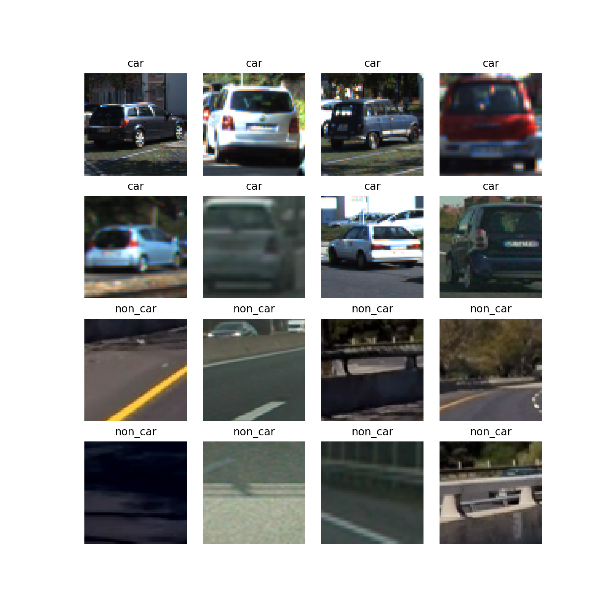

I then explored different color spaces and different  parameters: 

```python
    colorspaces = ["RGB", "HSV", "LUV"]
    orients = [12]
    pix_per_cells = [8, 16]
    cell_per_blocks = [2]
    hog_channels = [0,1,2,"ALL"]
    spatial_feats = [True]
    hist_feats = [True]
    spatial_sizes = [(16,16), (32,32)]
    hist_bins = [16, 32]
```

The `extract_features` method (line 311-356), is extracted from the lesson examples, it uses the [`skimage.hog()`](http://scikit-image.org/docs/dev/auto_examples/features_detection/plot_hog.html) for any the defined channels and colorspaces.

An example of HOG features for the following parameters is shown below, I will discuss later on why I started with those parameters.
```python
    colorspaces = "RGB"
    orients = 12
    pix_per_cells = 8
    cell_per_blocks = 2
    hog_channels = ALL
    spatial_feats = [True]
    hist_feats = [True]
    spatial_sizes = (16,16)
    hist_bins = (32)
```

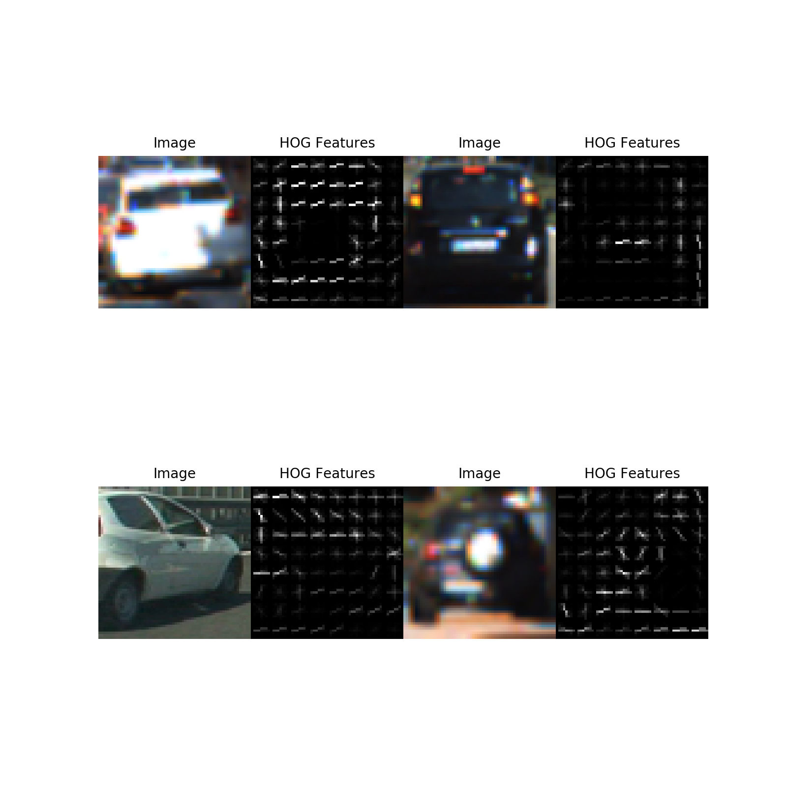

#### 2. Explain how you settled on your final choice of HOG parameters and features vector.

There is a significant number of hyperparameters to tune. The interactions between them cannot be easily understood and appear to be highly non-linear.

* `Training_Mode`: I complied list of the all the required hyper parameters for the feature vector:

```python
    colorspaces = ["RGB", "HSV", "LUV"]
    orients = [12]
    pix_per_cells = [8, 16]
    cell_per_blocks = [2]
    hog_channels = [0,1,2,"ALL"]
    spatial_feats = [True]
    hist_feats = [True]
    spatial_sizes = [(16,16), (32,32)]
    hist_bins = [16, 32]

    hyper_parameters = itertools.product(colorspaces, 
                                        orients,
                                        pix_per_cells,
                                        cell_per_blocks,
                                        hog_channels,
                                        spatial_feats,
                                        hist_feats,
                                        spatial_sizes,
                                        hist_bins)
```

* Loaded only 500 vehicle & 500 non-vehicle images
> 80% training, 20% test
> Randomly shuffled

The results from the training are stores in [training_scores.csv](./training_scores.csv),

The training time and accuracy for the hyper parameter sets created above are shown here:

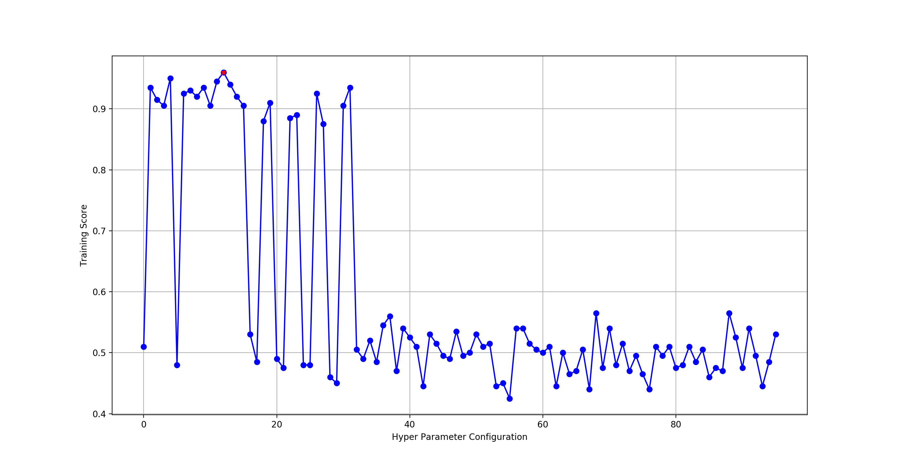
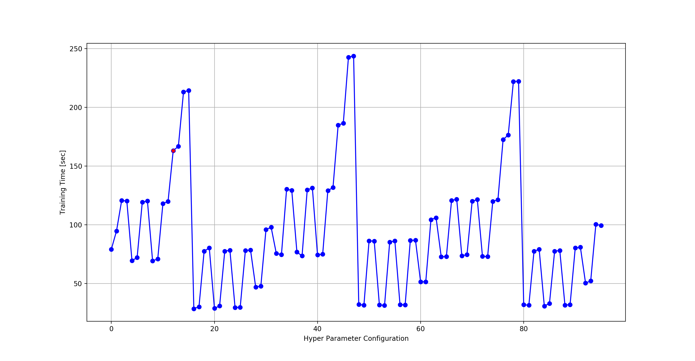

I started by selecting the best set of hyperparameters from this analysis:
```python
    colorspaces = "RGB"
    orients = 12
    pix_per_cells = 8
    cell_per_blocks = 2
    hog_channels = ALL
    spatial_feats = [True]
    hist_feats = [True]
    spatial_sizes = (16,16)
    hist_bins = (32)
```
Unfortunately the results were not satisfactory, after some experimentation I was able to improve the results by removing the spatial and histogram binning. 

I improved the results by using different color spaces

HUV:
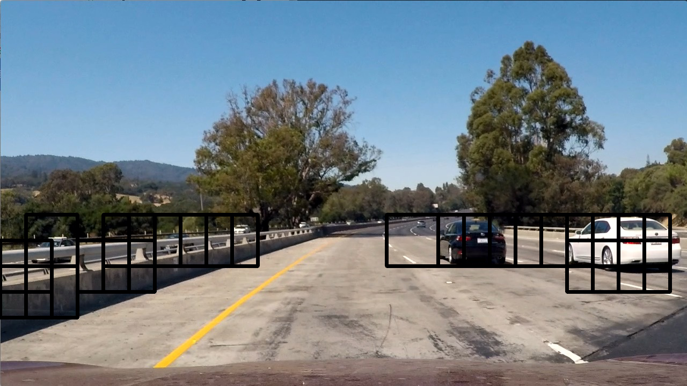

YUV:


YUV: Performed with the combination of the aforemention HOG parameters produced the best results with the test images:
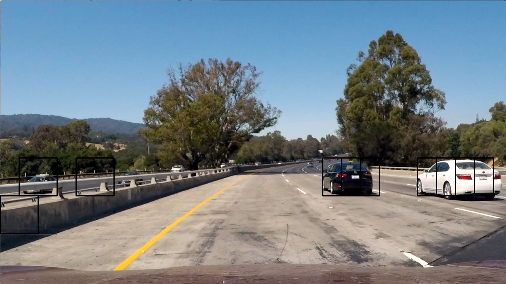

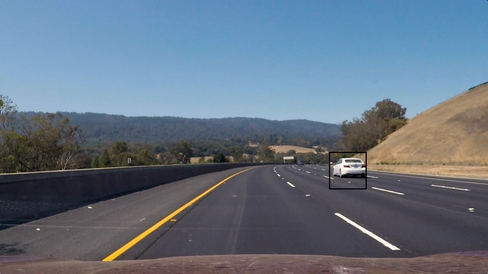
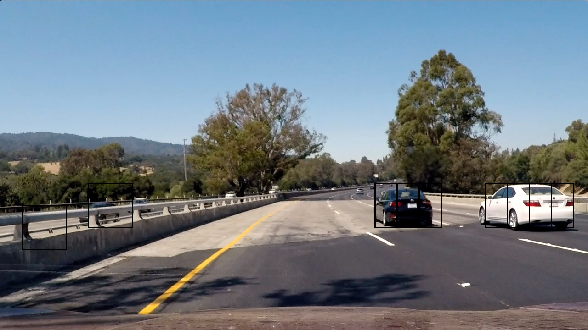
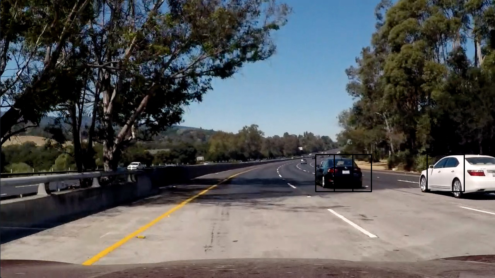
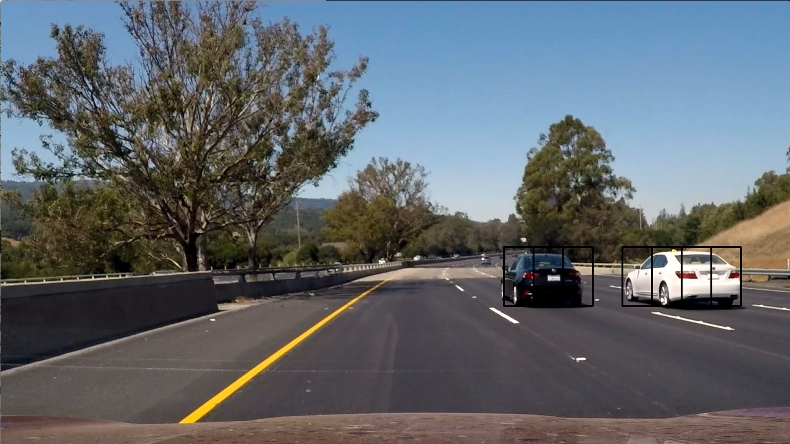


#### 3. Describe how (and identify where in your code) you trained a classifier using your selected HOG features (and color features if you used them).

In the `train_classifier()` method of the `Training` class (line 121-156), I used a grid search for every combination of feature vectors identified in the previous section, it was clear that a single set of classifier parameters was not going to suit each feature vector.

```python
  parameters = {'kernel':('linear', 'rbf'), 'C':[0.1, 1, 10], 'gamma': [0.1, 1, 10]}
  svr = svm.SVC()
  self.classifier = GridSearchCV(svr, parameters)
  self.classifier.fit(self.X_train, self.y_train)
```
        
### Sliding Window Search

#### 1. Describe how (and identify where in your code) you implemented a sliding window search.  How did you decide what scales to search and how much to overlap windows?

I found the scales and ylimits recommended in this [blog post](http://jeremyshannon.com/2017/03/17/udacity-sdcnd-vehicle-detection.html) to work rather well, essentially it divided the search area into three ranges (low, medium, far) and implemented two scales for each range. I added a 0.8 scale at a higher ylimit to classify small cars that were further away. 

The scales were implemented in the `process_frame()` (line 529), this function essentially implements the classification pipeline for each frame that is passed to it. This essentially focuses the search on a particular range of vehicle e.g:

```python
     # close range
        self.ystart = 400
        self.ystop = 596
        self.scale = 3.5
        bounding_boxes.append(self.object_detection(img))
```

The search boxes are shown below, the perspective of the camera is captured, the further away we are the smaller the box size is:
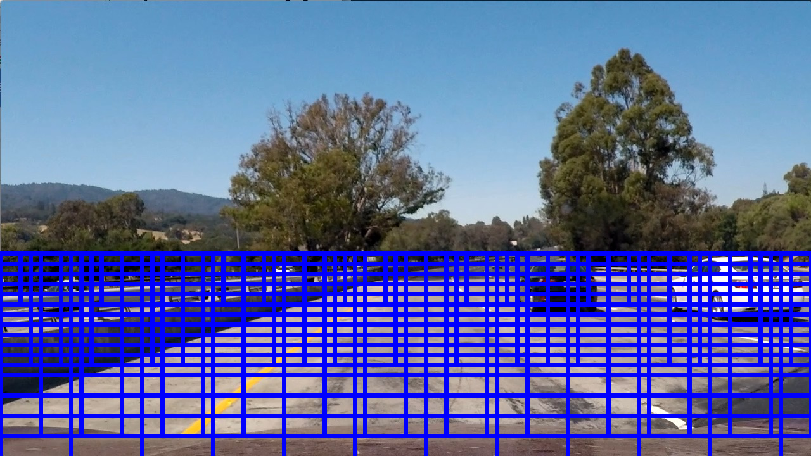

* For a given ylimit the image search is limited `ctrans_tosearch = img[self.ystart:self.ystop,:,:]` the blocks are translated based on the pix_per_cell parameters and cell_per_block. 
* Each block is resized to the original training size 64px,64px using `cv2.resize`. 
* For each sliding window, `extract_img_feature()` is called to extract the feature vector as used in the training stage. 
* The feature vector is passed to the `self.classifier.predict()` to predict the class of the feature vector, if a car is detected, the sliding dimensions are added to the `bounding_boxes` list for plotting or further processing.

#### 2. Show some examples of test images to demonstrate how your pipeline is working.  What did you do to optimize the performance of your classifier?

I verfied the performance using the test image and video
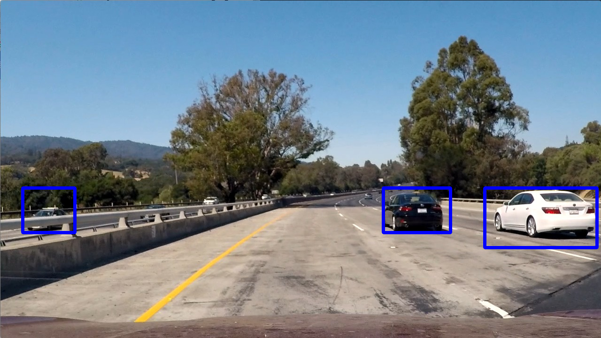

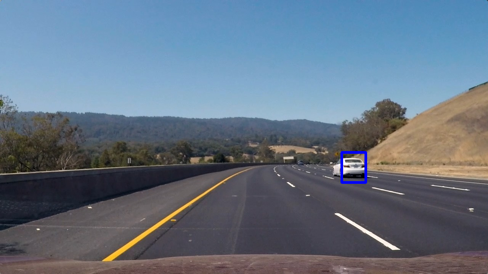
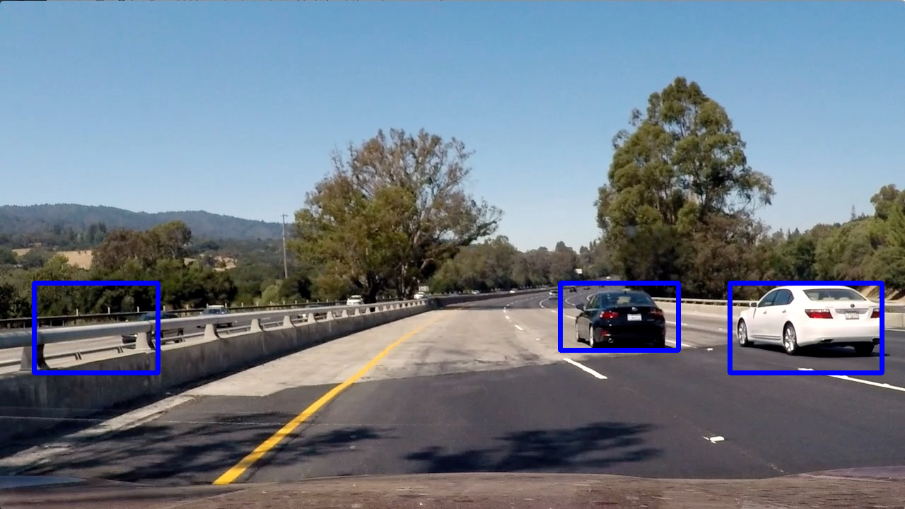
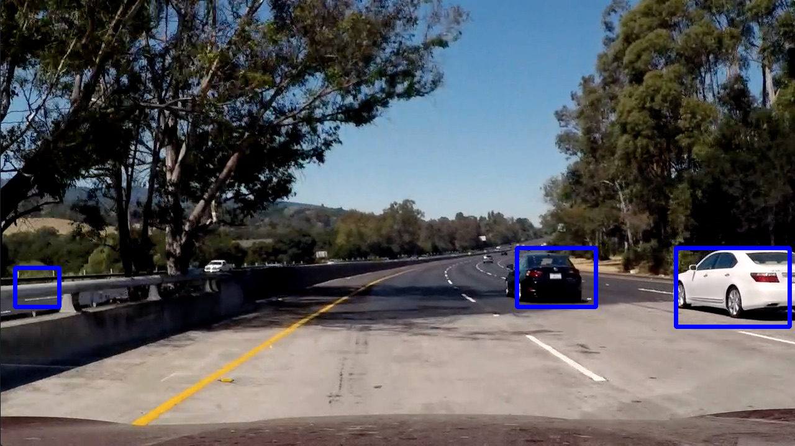
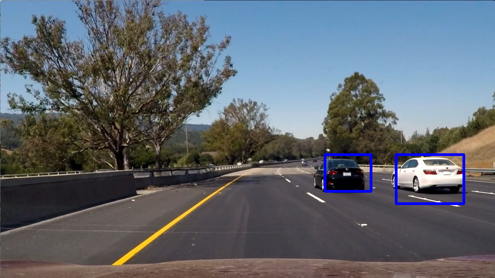

[Test_Video_Result](./test_video_out.mp4)

### Video Implementation

#### 1. Provide a link to your final video output.  Your pipeline should perform reasonably well on the entire project video (somewhat wobbly or unstable bounding boxes are ok as long as you are identifying the vehicles most of the time with minimal false positives.)
Here's a [link to my video result](./project_video_output.mp4)


#### 2. Describe how (and identify where in your code) you implemented some kind of filter for false positives and some method for combining overlapping bounding boxes.

I recorded the positions of positive detections in each frame of the video.  From the positive detections I created a heatmap and then thresholded that map to identify vehicle positions.  I then used `scipy.ndimage.measurements.label()` to identify individual blobs in the heatmap.  I then assumed each blob corresponded to a vehicle.  I constructed bounding boxes to cover the area of each blob detected.  

Here's an example result showing the heatmap from a series of frames of video, the result of `scipy.ndimage.measurements.label()` and the bounding boxes then overlaid on the last frame of video:

### Here is an example image and its corresponding heatmaps:
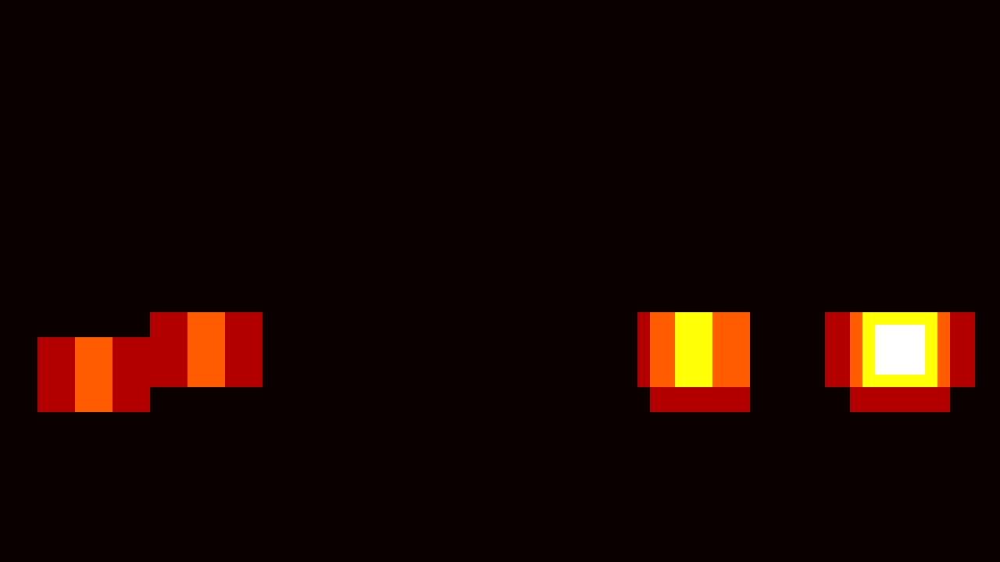


### Here is the output of `scipy.ndimage.measurements.label()` on the integrated heatmap from all six frames:

### Here the resulting bounding boxes are drawn onto the last frame in the series:

---

### Discussion

#### 1. Briefly discuss any problems / issues you faced in your implementation of this project.  Where will your pipeline likely fail?  What could you do to make it more robust?

Here I'll talk about the approach I took, what techniques I used, what worked and why, where the pipeline might fail and how I might improve it if I were going to pursue this project further.  

