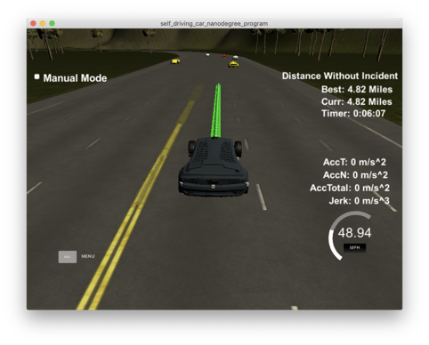

# Self-Driving Car Path Planning
An Udacity Self-Driving Car Engineer Nanodegree Program Project

---

## Introduction
The aim of this project is to safely navigate a highway. The vehicle is driving +-10 MPH of the 50 MPH speed limit. 

### Inputs:
 - Vehicle's location
 - Surrouding Vehicles position and speed (refered to as remotes)
 - High way map

### Output:
 - Driving close to the speed limit.
 - Avoiding collisions.
 - Stay on the road.
 - Complete one loop.
 - Do not exceed jerk and acceleration limits
---
## Performance
Desired outcomes are achieved, the vehicle is able to drive without any incidents



[Video of drive!](https://www.youtube.com/watch?v=-_O9b3eb4U4&feature=youtu.be)

---
## Implementation
The approach is divided into three main modules

**1. Longitduinal Speed Control:** 

Target velocity is set based on whether the lane ahead is occupied or not using a PID controlled. 
```cpp
...
// set target speed
if (lane_control.too_close)
{
  target_speed_mph = lane_control.remote_velocity_mph;
} else {
  target_speed_mph = 49;
}
....
// PID Controller
double vel_error = vehicle_velocity_mph - target_speed_mph;
speed_control.update(vel_error);
vehicle_velocity_mph += speed_control.TotalError(); // adjust speed
```

**2. Lateral Position Control:** 

Iterate through remote vehicles, update occupancy of each lane and whether car ahead is too
```cpp
// proximity check to left and right lanes
remote_too_close(distance_to_remote_m, margin_m, remote_lane, remote_d);
```
If car ahead is too close need to find an appropriate lane
If there are no free lanes, we would have to slow down.
```cpp
// if car ahead is too close
if (left_lane_free && right_lane_free) // both are free
    {
      if (right_margin_m > left_margin_m) // choose the freeier lane
      {
        turn_right();
      } 
      else 
      {
        turn_left();
      }
    }
    else if (left_lane_free) // only left
    { 
      turn_left();
    } 
    else if(right_lane_free) // only right
    {
      turn_right();
    }  
```

If car ahead is not too close, still find a better lane if available
```cpp
    if (!too_close) 
    {
      if (left_lane_free
         && 
         (left_margin_m>ahead_margin_m))
         {
          turn_left();
          cout << "left lane has more space "<< endl;
         } 
      if (right_lane_free
         && 
         (right_margin_m>ahead_margin_m))
         {
          cout << "right lane has more space "<< endl;
          turn_right();
         } 
    }
```

**3. Trajectory generation:** 
Convert desired lane position from frenet frame to cartestian waypoints. A piecewise linear uniformly sample spline can be generated. The car is expected to visit each of these points every `0.02 secs`, so the number of the points are calculated by `N = double N = (target_dist/(0.02*ref_vel/2.24))`

```cpp
            // create a spline
            tk::spline s;

            //set (x,y) points to the spline
            s.set_points(ptsx, ptsy); // the anchor points/waypoints

...
...

            // fill up the rest of our path planner after filling it with previous points, here we will always output 50 points
            for (int i = 1; i <= 60-previous_path_x.size(); i++)
            {
              double N = (target_dist/(0.02*ref_vel/2.24)); // 2.24: conversion to m/s
              double x_point = x_add_on+(target_x)/N;
              double y_point = s(x_point);

              x_add_on = x_point;

              double x_ref = x_point;
              double y_ref = y_point;

              // go back to global coordinate
              x_point = x_ref*cos(ref_yaw)-y_ref*sin(ref_yaw);
              y_point = x_ref*sin(ref_yaw)+y_ref*cos(ref_yaw);

              x_point += ref_x;
              y_point += ref_y;

              next_x_vals.push_back(x_point);
              next_y_vals.push_back(y_point);
            }
```            

---
